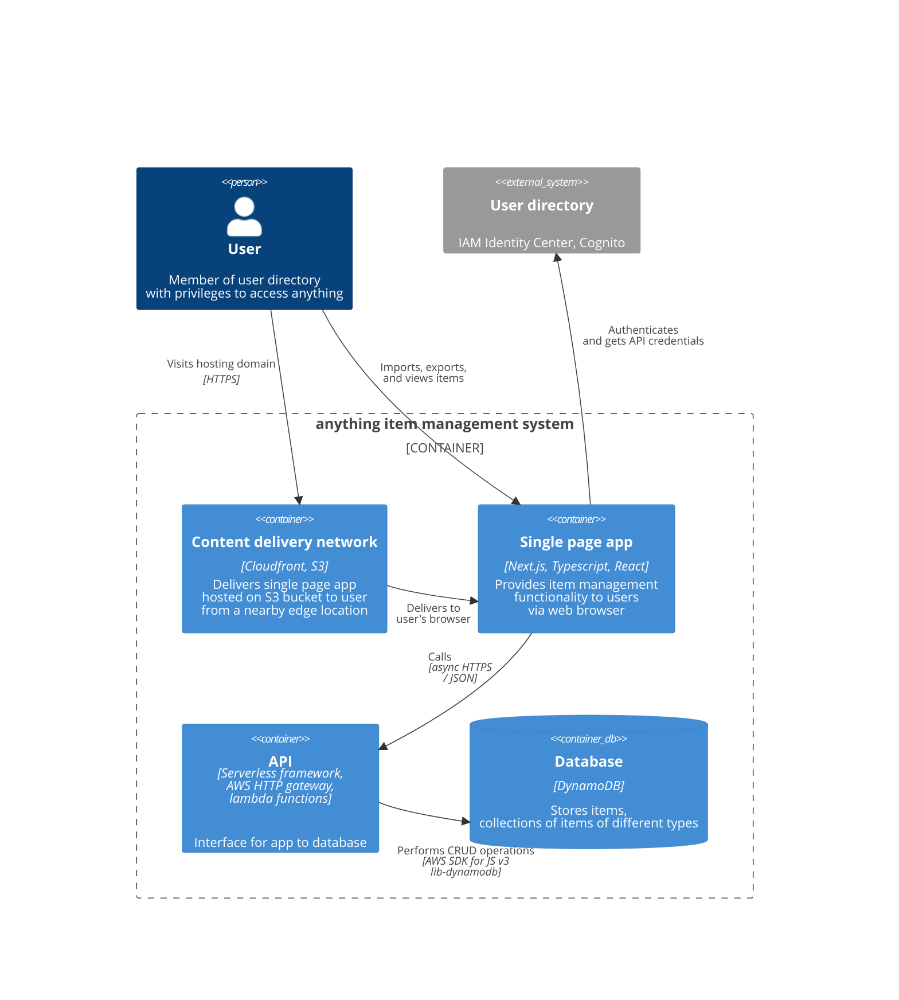

# anything

anything is a document storage / item management system designed to be flexible about the underlying data schema.

Anyone with an AWS account can setup a user directory in IAM Identity Center, edit a couple environment variables, and deploy (or remove) the system with one command.

Then users can view data, and import/export spreadsheets via a web app. The system is serverless, with provisioned resources billed per use.

_Please note this is an example app not intended for production. If you want to use the code in a production app under the terms of the AGPL, you'll need to grab a [MUI license](https://mui.com/x/introduction/licensing/) or rework the code to remove x-data-grid-premium._

## Architecture

- Serverless Framework api run by AWS Lambda functions fronted by HTTP gateway. Can be run off localhost via Serverless plugins.
- DynamoDB picked for on demand document storage.
- Almost all infrastructure defined in code, except authorisation provider (IAM Identity Center, currently lacks much CloudFormation support).
- Client run on Next.js via the experimental app router (but just exported to a static bundle for hosting via an S3 bucket anyways).
- MUI's x-data-grid powers client data tables. TailwindCSS used for styling with daisyUI on top to simplify basic component styling and add theming support.

### C4 Diagrams

1. System context


2. Containers



## Running locally

Edit the environment variables in .env as appropriate and load using [direnv](https://direnv.net/).


Refer to `packages/api/README.md` and `packages/app/README.md` for setting up the serverless api and web app.

After you've setup the api and app, you can spin up all projects at once with Turborepo using:

```sh
npm run dev
```

## Deployment

Refer to the readmes for `packages/api` and `packages/app` to deploy the backend and host the web app on the client.

## Monorepo structure

This Turborepo includes the following packages and apps:

- `api`: a [Serverless](https://serverless.com/) api on AWS or localhost
- `app`: a [Next.js](https://nextjs.org/) app using app router
- `logger`: a small wrapper around console.log
- `utils`: some shared code between api and app
- `eslint-config-*`: ESLint configurations
- `tsconfig`: tsconfig.json's used throughout the monorepo
